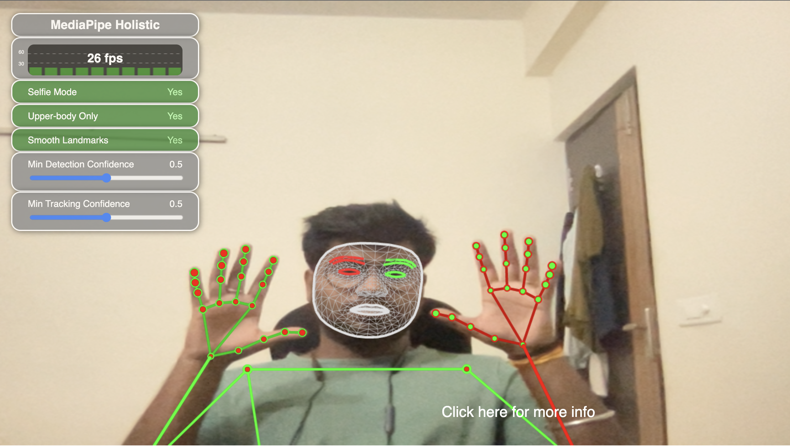

# Holistic-Human-Classifier

## MediaPipe Holistic

Live perception of simultaneous human pose, face landmarks, and hand tracking in real-time on mobile devices can enable various modern life applications: fitness and sport analysis, gesture control and sign language recognition, augmented reality try-on and effects. MediaPipe already offers fast and accurate, yet separate, solutions for these tasks. Combining them all in real-time into a semantically consistent end-to-end solution is a uniquely difficult problem requiring simultaneous inference of multiple, dependent neural networks.

# Result 

